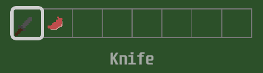
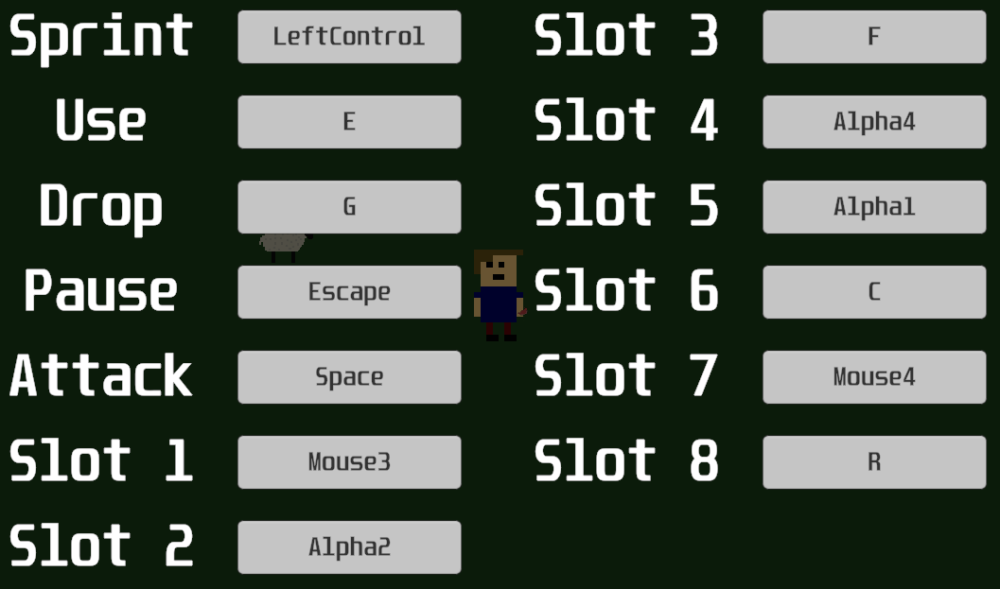

# AShadedBlobfish

Computer Science student with a passion for FOSS
 

Basic knowledge of Java, C++, HTML, CSS and JavaScript

Intermediate knowledge of C# and Python

### November 23rd  
November 23rd is an upcoming game I am working which will be set in a post-apocalyptic world, and will require the player to use their skills to escape from a location in which they are trapped.
  
 

